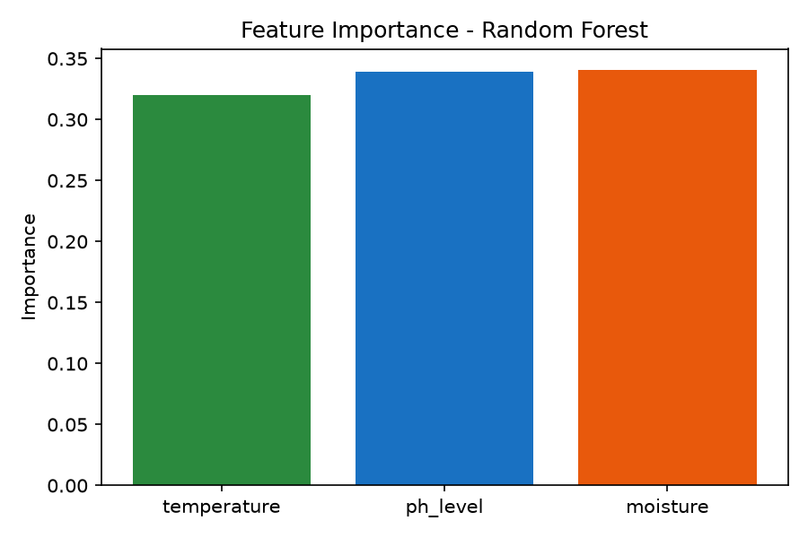
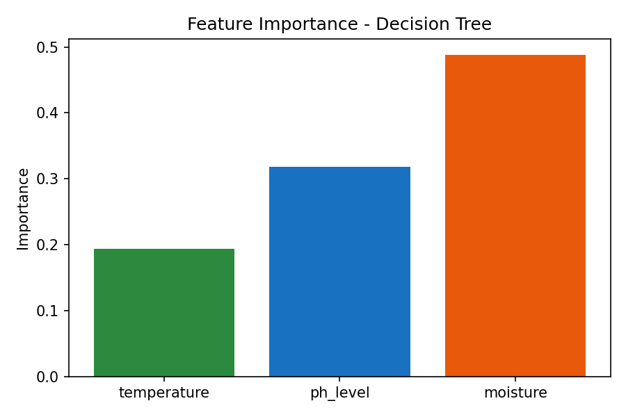
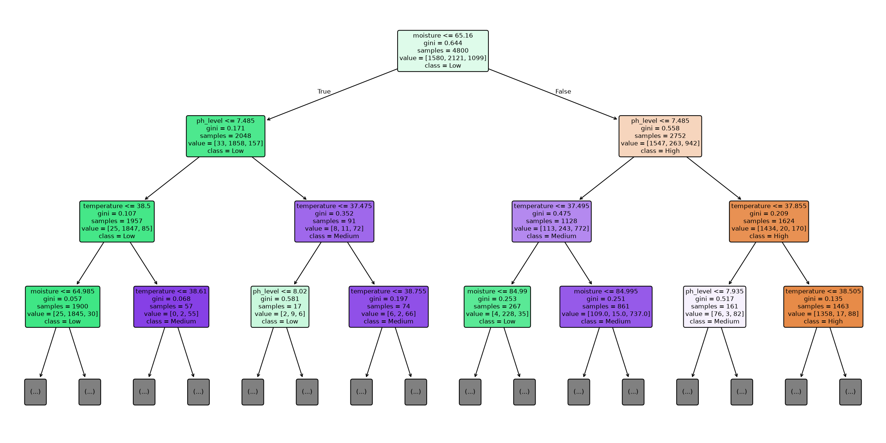
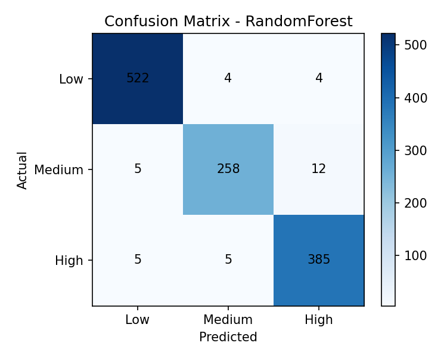

# DermaSensor
**Dynamic Electronic Real-time Monitoring & Assessment for Surgical Exudate**

A smart-bandage concept demo: three wound-bed sensor readings — **temperature**,
**pH**, and **moisture** — are turned into an infection **risk class**
(Low / Medium / High), with a full explanation of *why*, combining a
transparent rule engine, a trained ML model, and optional Llama 3 narration.

---

## How it works

```
generate_dataset.py   -> dermasensor_dataset.csv   (rule-labeled synthetic data)
train_model.py         -> model.joblib, *.png       (RandomForest + Decision Tree)
app.py                 -> Flask API + serves index.html
index.html              -> frontend UI, calls /api/predict
```

### 1. The rule engine (ground truth)
Clinically-motivated thresholds decide risk points per factor:

| Factor | Normal | Elevated (+1) | High (+2) |
|---|---|---|---|
| Temperature | < 37.5°C | 37.5–38.5°C | > 38.5°C |
| pH | 4.0–6.0 | 6.0–7.5 / < 4.0 | > 8.0 |
| Moisture | 20–65% | 65–85% | > 85% |

Score 0–1 → **Low**, 2–3 → **Medium**, 4+ → **High**.
This same function (`rule_engine()` in `generate_dataset.py`) is imported
by the backend, so every prediction can be traced back to the exact rule
that produced its training label.

### 2. Why this hybrid method
DermaSensor deliberately combines three complementary approaches instead
of relying on one opaque classifier or one fixed set of thresholds:

| Layer | What it contributes | Why it is needed |
|---|---|---|
| Clinical rule engine | Converts temperature, pH, and moisture thresholds into a risk score | Provides an immediate, deterministic baseline that can be inspected and challenged by a clinician |
| Random Forest | Learns non-linear relationships between the three readings and returns class probabilities | Handles noisy sensor combinations more flexibly than independent thresholds; this is the deployed model |
| Decision Tree + explanation layer | Shows simple decision paths, feature importance, fired thresholds, and the final reasoning | Makes the result auditable instead of presenting a prediction without context |

This is the best fit for a wound-monitoring prototype because the rule engine
preserves domain knowledge, while the Random Forest captures interactions that
hand-written rules may miss. Keeping both outputs also makes disagreements
visible: a clinician can compare the learned prediction with the independent
rule-based score before acting. The Decision Tree is not selected for
deployment when the Random Forest performs better; it is retained as a compact
interpretability reference. The optional Llama 3 integration only rephrases
these existing findings and does not make the medical decision.

On the current 20% stratified test split, the Decision Tree reaches **95.00%**
accuracy and the Random Forest reaches **97.00%**, so the training script
selects Random Forest for `model.joblib`. These results are prototype metrics
on synthetic data, not clinical validation.

#### Random Forest classification report

The deployed Random Forest maintains strong precision and recall across all
three risk classes, rather than achieving its accuracy by favoring only the
largest class:

| Class | Precision | Recall | F1-score | Test samples |
|---|---:|---:|---:|---:|
| High | 0.96 | 0.97 | 0.97 | 395 |
| Low | 0.98 | 0.98 | 0.98 | 530 |
| Medium | 0.96 | 0.94 | 0.95 | 275 |
| **Accuracy** |  |  | **0.97** | **1,200** |
| **Macro average** | **0.97** | **0.97** | **0.97** |  |
| **Weighted average** | **0.97** | **0.97** | **0.97** |  |

#### Why Random Forest is selected

Random Forest is selected for deployment because it outperforms the single
Decision Tree on the held-out test set (**97%** versus **95%** accuracy) while
remaining suitable for this prototype's explainability requirements. Its
ensemble of 200 trees is less sensitive to the noise and boundary changes in
sensor readings than one tree, and `class_weight="balanced"` helps prevent
the class distribution from dominating the result. It also supplies class
probabilities and feature importances, which the API uses for transparent
results. The Decision Tree remains in the pipeline as a human-readable
comparison and visualization, while the independent rule engine remains the
clinical safety reference.

#### Training and explainability results

The plots generated by `train_model.py` document both model behavior and
evaluation quality:

**Random Forest feature importance** shows which sensor readings contribute
most to the ensemble's decisions.



**Decision Tree feature importance** provides a second, simpler view of the
same sensor contributions and helps compare the compact model with the
deployed ensemble.



**Decision Tree visualization** exposes representative decision paths and
threshold splits. It is limited to depth 3 in the figure so it remains
readable, while the trained comparison tree uses depth 5.



**Confusion matrix** checks whether each risk class is being confused with
another, which is more informative than accuracy alone for the Low, Medium,
and High classes.



### 3. Explainability layer
Every `/api/predict` response includes:
- the ML risk class + probability for each class
- the rule-engine's independent score and which exact thresholds fired
- a natural-language explanation

The explanation is generated by a deterministic template by default
(works fully offline). If you run a local [Ollama](https://ollama.com)
server with a Llama 3 model pulled (`ollama pull llama3`), the backend
will automatically detect it and have Llama 3 phrase the same
rule/ML findings in more natural clinical language — it's told to use
only the numbers it's given, so it can't invent figures.

---

## Running it locally

```bash
pip install -r requirements.txt

# 1. Regenerate the dataset (optional, one is already included)
python generate_dataset.py

# 2. Retrain the model (optional, model.joblib is already included)
python train_model.py

# 3. Start the backend (also serves the frontend at the same URL)
python app.py
```

Open **http://localhost:5000** — the page is served directly by Flask,
so no separate web server is needed.

### Live sensor connection

The web interface can receive real-time readings from an ESP32 over USB
serial. Use Chrome or Edge, open the app through
`http://localhost:5000`, click **Connect live sensor**, and select the serial
device. The ESP32 should send one JSON object per line at **115200 baud**.
For this prototype, pH is held at a fixed value of **5.2**; only temperature
and moisture are read from the hardware:

```text
{"temperature":36.8,"moisture":45}
```

Each valid packet updates the displayed readings and automatically calls the
existing `/api/predict` endpoint, with `ph_level=5.2` added by the UI. Live
hardware therefore uses the same validation,
Random Forest model, rule engine, and explanation pipeline as manual input.
The sensor gateway must be calibrated and electrically isolated as appropriate
for patient use; this prototype is for development and demonstration, not a
clinical device.

An example ESP32 sketch is provided in `esp32_sensor.ino`. It reads a DHT22
temperature sensor and an analog moisture probe, then emits the required JSON
format. Install the Arduino **DHT sensor library**, select the ESP32 board,
check `DHT_PIN` and `MOISTURE_PIN` against your wiring, and calibrate
`MOISTURE_DRY_RAW` and `MOISTURE_WET_RAW` before uploading. The sketch uses
GPIO 4 for the DHT data line and GPIO 34 for the analog moisture signal by
default; these are examples, not universal wiring requirements.

### Optional: enable Llama 3 explanations
```bash
ollama pull llama3
ollama serve                     # usually already running as a service
export DERMASENSOR_USE_LLM=on    # or leave as "auto" to auto-detect
python app.py
```

---

## API reference

**POST** `/api/predict`
```json
{ "temperature": 38.9, "ph_level": 8.1, "moisture": 88 }
```
Response (abridged):
```json
{
  "risk_class": "High",
  "probabilities": {"Low": 0.01, "Medium": 0.05, "High": 0.94},
  "rule_engine": {"risk_class": "High", "risk_score": 5, "points": {...}},
  "top_feature": "ph_level",
  "rule_breakdown": ["Temperature 38.9°C is ...", "..."],
  "explanation": "...",
  "explanation_source": "rule-based-template"
}
```

**GET** `/api/health` → `{"status": "ok", "model_classes": [...]}`

---

## Hosting options

- **Quickest (single machine / demo):** `python app.py` — Flask serves
  both the API and `index.html` on one port. Good enough for a hackathon
  demo or judged walkthrough.
- **Production-style:** run behind `gunicorn`:
  `gunicorn -w 2 -b 0.0.0.0:5000 app:app`, then put Nginx or a platform
  like Render / Railway / PythonAnywhere in front of it.
- **Static frontend + separate backend:** `index.html` can be hosted
  anywhere static (GitHub Pages, Netlify) — just edit `API_BASE` at the
  top of its `<script>` block to point at wherever `app.py` is deployed,
  and make sure CORS (already enabled via `flask-cors`) allows that origin.

---

## Files

| File | Purpose |
|---|---|
| `generate_dataset.py` | Rule-based  dataset + shared `rule_engine()` |
| `dermasensor_dataset.csv` | 6,000-row  dataset |
| `train_model.py` | Trains RF + Decision Tree, saves model + plots |
| `model.joblib` | Trained model bundle (model + feature list + classes) |
| `app.py` | Flask backend: `/api/predict`, `/api/health`, serves frontend |
| `index.html` | Frontend UI (sliders, presets, risk result, explanation) |
| `esp32_sensor.ino` | ESP32 example firmware for live temperature and moisture readings |
| `feature_importance_rf.png` / `feature_importance_tree.png` | Feature importance plots |
| `decision_tree.png` | Visualized decision tree (depth 3) |
| `confusion_matrix.png` | Test-set confusion matrix |
| `requirements.txt` | Python dependencies |

---

## Notes / next steps for a real deployment
- Real sensor hardware would replace the manual sliders with live
  readings streamed to `/api/predict` (e.g. via BLE gateway → REST call).
- The rule thresholds here are illustrative and grounded in general
  wound-care literature (acidic pH and near-body temperature for healthy
  healing wounds; alkaline shift, elevated temperature and excess exudate
  as infection indicators) — a real clinical deployment should validate
  thresholds against a wound-care specialist and peer-reviewed sources
  before use on patients.
