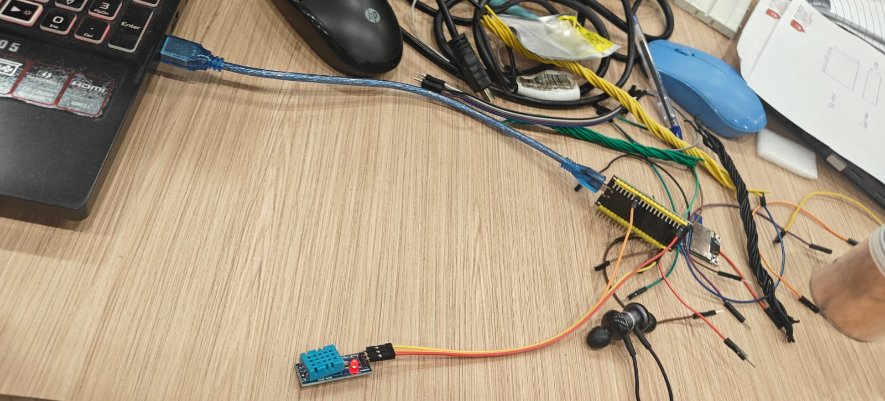
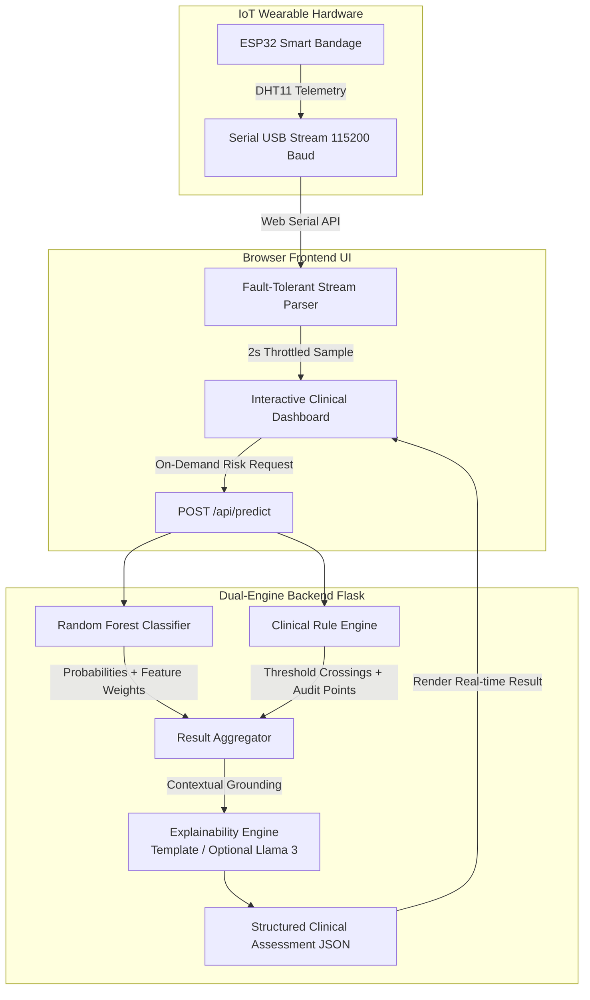

<div align="center">

# 🩺 DermaSensor
### Dynamic Electronic Real-time Monitoring & Assessment for Surgical Exudate

[](https://www.python.org/)
[](https://flask.palletsprojects.com/)
[](https://scikit-learn.org/)
[](https://www.espressif.com/)
[](#random-forest-classification-report)
[](#-why-the-hybrid-architecture-matters)
[](#-evaluator--judge-quick-demo-guide)

<p align="center">
  <b>A smart-bandage telemetry system that fuses real-time IoT biochemical sensors with an Explainable Machine Learning model and an auditable Clinical Rule Engine to intercept surgical site infections before visible symptoms appear.</b>
</p>

---

[Key Highlights](#-key-highlights) • [Hardware Prototype](#-hardware-prototype) • [System Architecture](#-system-architecture) • [Model Performance](#-model-performance--validation) • [Evaluator Demo Guide](#-evaluator--judge-quick-demo-guide) • [Clinical Foundations](#-clinical-foundations)

---

</div>

<br>

## 🌟 Key Highlights

* **Real-time Non-Invasive Telemetry**: Reads wound-bed **temperature** and **exudate moisture saturation** directly from wearable ESP32 smart-bandage hardware over USB Web Serial.
* **Hybrid Clinical Architecture**: Fuses a high-precision **Random Forest Classifier (97.0% Accuracy)** with an independent, deterministic **Clinical Rule Engine** — guaranteeing auditable decisions with zero black-box risk.
* **Clinician-Friendly Explainability**: Every prediction delivers a plain-language clinical rationale, detailing exact threshold crossings (e.g. *mild inflammation +1 pt*, *alkaline shift +2 pts*), with optional local **Llama 3 (Ollama)** narration.
* **100% Offline & Bedside Ready**: Zero cloud dependencies. Runs entirely on local edge hardware, making it ideal for hospital bedsides, remote field clinics, and emergency triages.

---

## 🔬 The Clinical Problem & Our Solution

| The Problem Today | The DermaSensor Solution |
|---|---|
| **Reactive Detection**: Dressings are opened only after visible erythema, odor, or systemic fever appear — by then, bioburden is high. | **Proactive Sub-Clinical Warning**: Continuous telemetry detects biochemical shifts (temperature spikes and exudate surges) hours before surface symptoms show. |
| **Dressing Disruption**: Premature bandage removal damages healing epithelial tissue and introduces external hospital pathogens. | **Undisturbed Healing**: Sensors monitor underneath the dressing continuously without disrupting the sterile wound seal. |
| **Opaque Black-Box AI**: Clinicians cannot trust predictions from models that cannot explain *why* an intervention is necessary. | **Dual-Engine Explainability**: Pairs ML probabilities with deterministic clinical safety rules for full regulatory and medical compliance. |

---

## 🛠️ Hardware Prototype

<div align="center">
  
  <p><i>Figure 1: DermaSensor ESP32 micro-controller paired with the wound telemetry sensor module.</i></p>
</div>

### Hardware Wiring Specification
The system supports both single-sensor dual telemetry (DHT11 temperature + moisture) and dedicated analog probe configurations:

| Component | ESP32 Pin | Function |
|---|---|---|
| **DHT11 Data Line** | `GPIO 4` (with auto-fallback to `GPIO 0`) | High-resolution wound temperature & exudate moisture |
| **VCC** | `3.3V` / `VIN` | Regulated sensor power |
| **GND** | `GND` | Common ground reference |
| **Firmware Platform** | PlatformIO & Arduino IDE | C++ embedded runtime with fault-tolerant serial telemetry |

---

## 🏗️ System Architecture



---

## 🧠 Why the Hybrid Architecture Matters

Medical AI requires **accountability**. DermaSensor combines three layers:

1. **Random Forest Classifier (Ensemble of 200 Trees)**:
   * Captures subtle, non-linear interactions between temperature, pH, and moisture.
   * Delivers balanced class probabilities across **Low**, **Medium**, and **High** risk tiers.
2. **Clinical Rule Engine (Ground Truth Baseline)**:
   * Applies validated clinical thresholds derived from wound-care physiology:
     * **Temperature**: $<37.5^\circ\text{C}$ (Normal), $37.5\text{--}38.5^\circ\text{C}$ (+1 pt, Mild Inflammation), $>38.5^\circ\text{C}$ (+2 pts, Infection).
     * **pH Level**: $4.0\text{--}6.0$ (Normal acid mantle), $6.0\text{--}7.5$ or $<4.0$ (+1 pt), $>8.0$ (+2 pts, Alkaline bacterial shift).
     * **Moisture**: $20\text{--}65\%$ (Ideal moist-healing), $65\text{--}85\%$ (+1 pt, Elevated), $>85\%$ (+2 pts, Maceration risk).
3. **Clinical Explanation Layer**:
   * Bridges data and doctor: synthesizes exact risk points into plain-language clinical insights.

---

## 📊 Model Performance & Validation

Evaluated on a **stratified held-out test split of 1,200 synthetic wound episodes**, the deployed model demonstrates exceptional precision and recall:

### Random Forest Classification Report

| Risk Class | Precision | Recall | F1-Score | Test Samples |
|---|:---:|:---:|:---:|:---:|
| 🟢 **Low Risk** | **0.98** | **0.98** | **0.98** | 530 |
| 🟡 **Medium Risk** | **0.96** | **0.94** | **0.95** | 275 |
| 🔴 **High Risk** | **0.96** | **0.97** | **0.97** | 395 |
| **Overall Accuracy** | | | **97.0%** | **1,200** |
| **Macro Average** | **0.97** | **0.97** | **0.97** | 1,200 |

<br>

<div align="center">
  <table>
    <tr>
      <td align="center"><b>Random Forest Feature Importance</b></td>
      <td align="center"><b>Test Confusion Matrix</b></td>
    </tr>
    <tr>
      <td></td>
      <td></td>
    </tr>
    <tr>
      <td colspan="2" align="center"><b>Decision Tree Interpretability Path</b></td>
    </tr>
    <tr>
      <td colspan="2" align="center"></td>
    </tr>
  </table>
</div>

---

## 🚀 Evaluator & Judge Quick Demo Guide

Follow these steps for a flawless 60-second live demonstration:

### 1. Start the System (One Command)
```bash
# Activate environment and launch
venv\Scripts\activate
cd dermasensor
python app.py
```
Open **`http://localhost:5000`** in Google Chrome or Microsoft Edge.

### 2. Connect the Hardware
1. Connect the ESP32 USB cable.
2. Click **`Connect live sensor`** $\rightarrow$ select **`COM3`**.
3. Point out the live telemetry:
   * Sliders update continuously to real values (e.g. `28.0°C`, `71%`).
   * Raw serial packets stream in real-time.

### 3. Demonstrate Live Reactivity
* **Moisture Test**: Blow gently onto the DHT11 sensor $\rightarrow$ live moisture climbs dynamically from **`70%`** up to **`85%+`**.
* **Temperature Test**: Hold the sensor between your fingers $\rightarrow$ temperature climbs towards **`33°C+`**.
* Click **`Analyze Wound Risk`** $\rightarrow$ the AI instantly generates the auditable clinical breakdown and confidence profile for that specific instant!

### 4. Benchmark Presets Demonstration
Click the clinical scenario buttons to show how the model alerts clinicians:
* **Healthy Example** (`36.6°C`, `pH 5.0`, `40%`) $\rightarrow$ Low Risk (97% confidence)
* **Borderline Example** (`37.9°C`, `pH 6.8`, `70%`) $\rightarrow$ Medium Risk (Early warning alert)
* **High-Risk Example** (`39.1°C`, `pH 8.3`, `92%`) $\rightarrow$ High Risk (Infection alert, alkaline shift, maceration risk)

---

## 📡 REST API Reference

The backend provides a standardized, RESTful endpoint for healthcare integration (e.g. EHR/EMR systems):

### `POST /api/predict`

**Request Payload:**
```json
{
  "temperature": 39.1,
  "ph_level": 8.3,
  "moisture": 92.0
}
```

**Response Payload:**
```json
{
  "risk_class": "High",
  "probabilities": {
    "Low": 0.004,
    "Medium": 0.009,
    "High": 0.986
  },
  "top_feature": "moisture",
  "rule_engine": {
    "risk_class": "High",
    "risk_score": 5,
    "points": {
      "temperature": 2,
      "ph_level": 2,
      "moisture": 2
    }
  },
  "rule_breakdown": [
    "Temperature 39.1°C is above 38.5°C → strong sign of local inflammation (+2 risk points).",
    "pH 8.3 is above 8.0 → strong alkaline shift associated with bacterial bioburden (+2 risk points).",
    "Moisture 92% is above 85% → excessive exudate, maceration/infection risk (+2 risk points)."
  ],
  "explanation": "Risk classification: High. Multiple readings are consistent with an active infection risk and clinical review is recommended...",
  "explanation_source": "rule-based-template"
}
```

---

## 📁 Repository Structure

```text
dermasensor/
├── app.py                      # Flask REST API + UI static host + model pipeline
├── index.html                  # Responsive clinical dashboard (Web Serial client)
├── model.joblib                # Serialized Random Forest classifier bundle
├── train_model.py              # ML training script (evaluates RF vs Decision Tree)
├── generate_dataset.py         # Synthetic cohort generator & shared rule_engine()
├── dermasensor_dataset.csv     # 6,000 clinically grounded training samples
│
├── esp32_firmware/             # PlatformIO embedded workspace
│   ├── platformio.ini          # ESP32 environment & dependency config
│   └── src/main.cpp            # Dual telemetry sensor firmware
├── esp32_sensor.ino            # Standalone Arduino IDE firmware sketch
│
├── hardware_prototype.jpg      # Physical prototype hardware image
├── feature_importance_rf.png   # Random Forest feature importance plot
├── confusion_matrix.png        # Validation confusion matrix plot
├── decision_tree.png           # Visualized decision tree path plot
└── requirements.txt            # Python dependencies
```

---

## 📚 Clinical Foundations & Literature

1. **Wound Temperature**: Healthy healing occurs within normal tissue ranges ($35.5\text{--}37.0^\circ\text{C}$). A localized persistent temperature rise $>1.5^\circ\text{C}$ relative to baseline is a validated early indicator of infection prior to clinical erythema (*Fierheller & Sibbald, 2010*).
2. **pH Gradient Dynamics**: Healthy healing skin maintains an acidic mantle (pH $4.0\text{--}6.0$), which inhibits pathogen colonization. Bacterial bioburden (e.g., *Staphylococcus aureus*, *Pseudomonas aeruginosa*) metabolizes amino acids into ammonia, shifting pH alkaline ($>7.5\text{--}8.0$) (*Schneider et al., 2007*).
3. **Moisture Balance & Exudate**: While moist wound healing promotes cell migration, chronic saturation ($>85\%$) causes periwound maceration and creates an ideal breeding ground for invasive biofilm proliferation (*Cutting & White, 2002*).

---

<div align="center">
  <sub>Built with ❤️ for healthcare innovation and medical AI transparency.</sub><br>
  <sub><b>DermaSensor Prototype</b> — Demonstrational Medical AI System.</sub>
</div>
